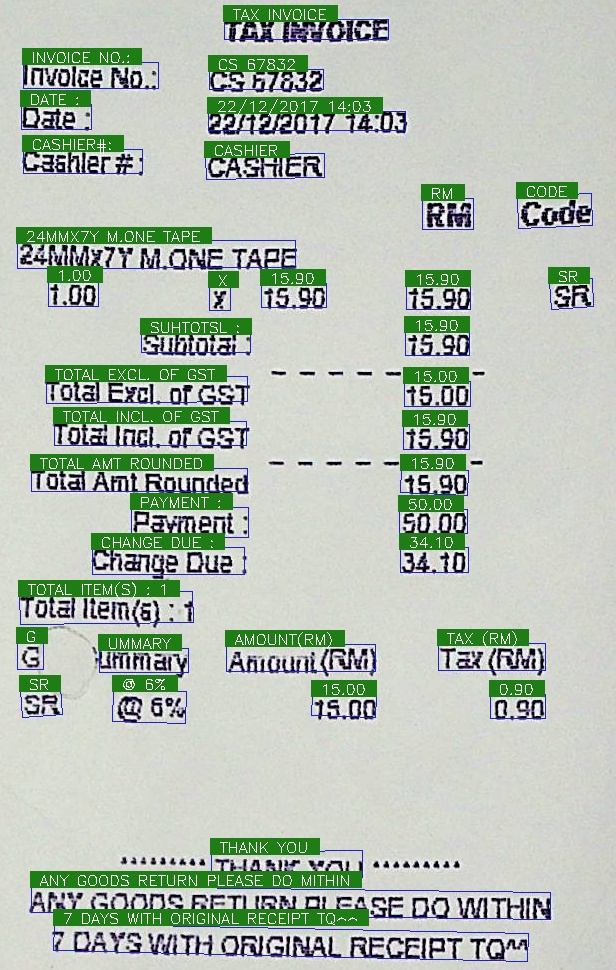

## ocr.pytorch
> 项目实践: OCR 
> 本实践项目来源： 唐宇迪OCR识别原理 实战

[B站ocr原理: https://www.bilibili.com/video/BV1r5411G7bi](https://www.bilibili.com/video/BV1r5411G7bi)

[B站ocr实战: https://www.bilibili.com/video/BV1TT4y1M7sU](https://www.bilibili.com/video/BV1TT4y1M7sU)

[Git 仓库](https://github.com/courao/ocr.pytorch)
  
Text detection is based CTPN and text recognition is based CRNN 

## Prerequisite

- python-3.5+
- pytorch-0.4.1+
- torchvision-0.2.1
- opencv-3.4.0.14
- numpy-1.14.3

They could all be installed through pip except pytorch and torchvision. As for pytorch and torchvision, 
they both depends on your CUDA version, you would prefer to reading [pytorch's official site](https://pytorch.org/)

### Detection
Detection is based on [CTPN](https://arxiv.org/abs/1609.03605), some codes are borrowed from 
[pytorch_ctpn](https://github.com/opconty/pytorch_ctpn), several detection results: 

### Recognition

Recognition is based on [CRNN](http://arxiv.org/abs/1507.05717), some codes are borrowed from
[crnn.pytorch](https://github.com/meijieru/crnn.pytorch)

### Test
Download pretrained models from [Baidu Netdisk](https://pan.baidu.com/s/1yllO9hBF8TgChHJ7i3WobA) (extract code: u2ff) or [Google Driver](https://drive.google.com/open?id=1hRr9v9ky4VGygToFjLD9Cd-9xan43qID)
and put these files into checkpoints.
Then run
>python3 demo.py

The image files in ./test_images will be tested for text detection and recognition, the results will be stored in ./test_result.

If you want to test a single image, run
>python3 test_one.py [filename]

### Train
Training codes are placed into train_code directory.  
Train [CTPN](./train_code/train_ctpn/readme.md)  
Train [CRNN](./train_code/train_crnn/readme.md)  

## CTPN 物体检测
 Connectionist Test Proposal Network 算法
 
 * 文本通常 从左往右写，字间距大概相同
 * 固定宽度，检测文本高度即可， 应对变长序列
 * 本质上还是 faste-rcnn，将检测道德框拼在一起

### CTPN 网络架构
 * VGG提取特征， BLSTM融入上下文信息，基于RPN完成检测
   > 论文地址:https://arxiv.org/pdf/1609.03605.pdf
 * 经过4次池化操作，特征图中一个像素对应原始输入的16个像素
 * Anchor 大小选择，宽度固定，长度选10个
   >
 * 输出结果：2k得分，2k回归，1k边界
 * 边界调整能使得文本检测框效果更好

 * 检测到每个小块文本区域，还需要拼接成完整的文本区域

## CRNN 识别算法
  > cnn + rnn
 * 使用cnn进行特征提取
 * 使用rnn进行序列特征提取，最后预测结果

### CTC 模块的作用
 CTC 处理变长序列，目的是对齐输入和输出结果

### Licence
[MIT License](https://opensource.org/licenses/MIT)

